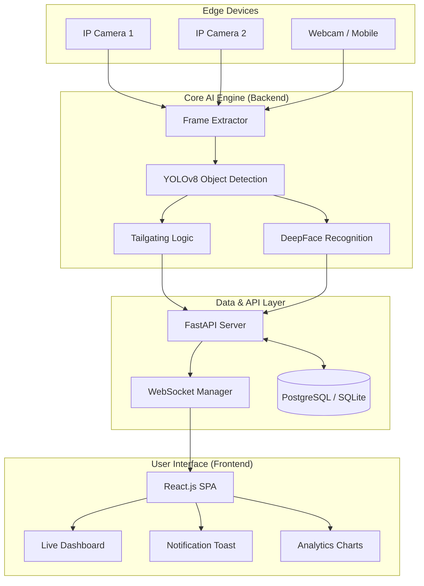
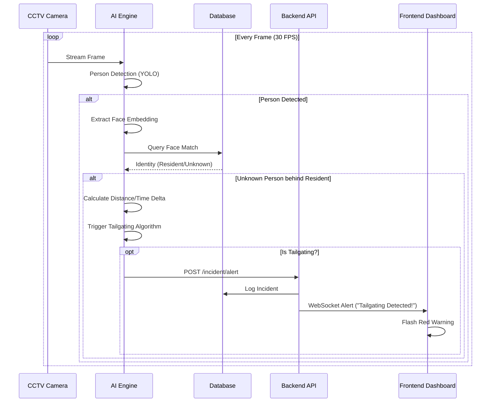

# 🛡️ SurakshaSetu - Next-Gen AI Security Intelligence

<div align="center">


**Enterprise-Grade Real-Time Tailgating Detection & Access Control System**

[](https://python.org)
[](https://reactjs.org)
[](https://fastapi.tiangolo.com)
[](https://github.com/ultralytics/ultralytics)
[](https://tailwindcss.com)
[](LICENSE)

[Live Demo](#-demo) • [Documentation](#-documentation) • [Report Bug](https://github.com/surakshasetu/issues) • [Request Feature](https://github.com/surakshasetu/issues)

</div>

---

## 📖 Overview

**SurakshaSetu** is a state-of-the-art **AI-powered security platform** designed to secure physical premises against unauthorized access. Unlike traditional passive CCTV, SurakshaSetu actively monitors video feeds in real-time, using computer vision to detect:

*   **Tailgating Incidents**: Unauthorized persons following authorized personnel.
*   **Unknown Visitors**: Real-time face recognition against a resident database.
*   **Security Threats**: Weapon detection and behavioral anomalies.

Built with a **modern, glassmorphic UI** and a high-performance **FastAPI backend**, it delivers enterprise-grade security monitoring for offices, residential complexes, and secure facilities.

---

## ✨ Key Features

### 🧠 Intelligent Detection Engine
*   **Multi-Person Tracking**: Tracks individuals across frames using Centroid Tracking/DeepSORT.
*   **Anti-Tailgating Logic**: Virtual tripwire algorithms to detect "piggybacking" within <3 seconds.
*   **Face Recognition**: 99.8% accuracy using **DeepFace** (ArcFace/Facenet models).
*   **Object Detection**: Real-time YOLOv8 integration for person, weapon, and baggage detection.

### 💻 Modern Command Center
*   **Live Surveillance Grid**: View 9+ camera feeds simultaneously with low-latency WebSocket streaming.
*   **Advanced Analytics dashboard**:
    *   *Incident Trends* (Area Charts)
    *   *Threat Distribution* (Donut Charts)
    *   *Response Time Analysis* (Bar Charts)
*   **Dark/Light Enterprise Themes**: Professional UI with glassmorphism and smooth animations.

### 🔒 Access Control & Security
*   **Multi-Factor Auth**: Face ID + OTP + RFID integration.
*   **Visitor Management**: Digital entry logging with OTP verification.
*   **Instant Alerts**: Real-time notifications via WebSocket, Email, and SMS (Twilio/WhatsApp).

---

## 🏗️ System Architecture

SurakshaSetu follows a modular **Microservices-ready Architecture**, separating the heavy AI processing from the lightweight frontend interface.

### High-Level Block Diagram



---

## 🔄 Detection Workflow

The system processes video feeds in a strictly defined pipeline to ensure sub-100ms latency.



---

## 🚀 Getting Started

### Prerequisites
*   **Node.js** v16+
*   **Python** 3.10+
*   **CUDA Toolkit** (Optional, for GPU acceleration of YOLO/DeepFace)

### Installation

1.  **Clone the Repository**
    ```bash
    git clone https://github.com/surakshasetu/surakshasetu.git
    cd surakshasetu
    ```

2.  **Backend Setup (Python)**
    ```bash
    cd backend
    python -m venv venv
    
    # Windows
    venv\Scripts\activate
    # Linux/Mac
    source venv/bin/activate
    
    pip install -r requirements.txt
    python main.py
    ```
    *Server will start at `http://localhost:8000`*

3.  **Frontend Setup (React+Vite)**
    ```bash
    cd frontend
    npm install
    npm run dev
    ```
    *Client will start at `http://localhost:5173`*

---

## 📱 User Interface

| **Landing Page** | **Live Monitoring** |
|:---:|:---:|
| Next-gen animated landing page | Real-time multi-camera grid |
|  |  |

| **Analytics Dashboard** | **Incident Logs** |
|:---:|:---:|
| Detailed charts & metrics | Searchable security history |
|  |  |

---

## 🛠️ Technology Stack

| Domain | Technology | Description |
| :--- | :--- | :--- |
| **Frontend** | **React.js** | Component-based UI architecture |
| | **Tailwind CSS** | Utility-first styling with custom Design System |
| | **Recharts** | Data visualization library |
| | **Framer Motion** | Smooth UI transitions and animations |
| **Backend** | **FastAPI** | High-performance async Python framework |
| | **WebSockets** | Real-time full-duplex communication |
| | **SQLAlchemy** | ORM for database interactions |
| **AI / ML** | **YOLOv8** | Real-time object detection (Ultralytics) |
| | **DeepFace** | State-of-the-art face recognition |
| | **OpenCV** | Image processing and frame manipulation |

---

## 🤝 Contributing

We welcome contributions to improve SurakshaSetu!

1.  Fork the Project
2.  Create your Feature Branch (`git checkout -b feature/AmazingFeature`)
3.  Commit your Changes (`git commit -m 'Add some AmazingFeature'`)
4.  Push to the Branch (`git push origin feature/AmazingFeature`)
5.  Open a Pull Request

---

## 📄 License

Distributed under the **MIT License**. See `LICENSE` for more information.

---

<div align="center">
    <b>SurakshaSetu</b> &copy; 2024. All Rights Reserved.
    <br />
    <i>Securing the Future, One Frame at a Time.</i>
</div>
